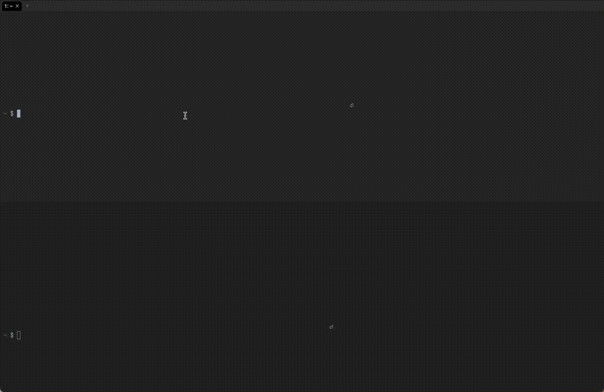

# tetris-tui
Tetris in the terminal



## Installation

You can download the latest binary from the [release page](https://github.com/quantonganh/tetris-tui/releases).

### macOS

```sh
$ brew install quantonganh/tap/tetris-tui
```

### Windows

```sh
scoop bucket add quantonganh https://github.com/quantonganh/scoop-bucket.git
scoop install tetris-tui
```

### Install on NetBSD

```
# pkgin install tetris-tui
```

### Install via cargo

```
$ cargo install tetris-tui
```
